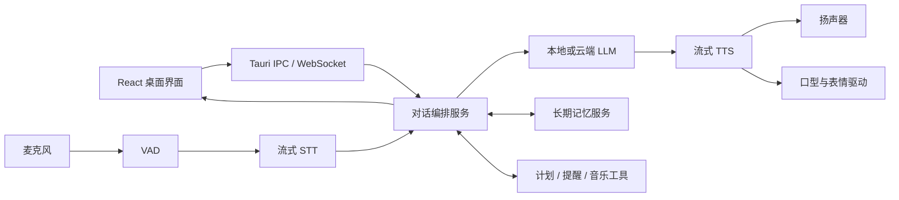

# 技术栈说明

## 选型原则

心屿优先考虑四件事：低延迟、本地隐私、可替换模型和桌面体验。模型与供应商都通过适配层接入，避免 UI、记忆和业务逻辑被某一个 API 绑定。

## 当前已落地

| 模块 | 技术 | 状态 |
| --- | --- | --- |
| Web UI | React 19.2、React DOM 19.2 | 已实现 |
| 构建工具 | Vite 6.4 | 已实现 |
| 图标 | Phosphor Icons React | 已实现 |
| 中文字体 | Noto Sans SC Variable | 已实现 |
| 自动验证 | Node Test Runner | 已实现站点 Worker 测试 |
| 语音参考实现 | Hugging Face `speech-to-speech` | 已固定为 Git 子模块，尚未接入 UI |

版本以 `apps/desktop-ui/package-lock.json` 和子模块提交为准，文档中的版本只用于快速理解。

## 目标运行架构



### 桌面层

- 目标：Tauri 2 + React。
- 原因：前端原型可以直接复用；安装包和常驻资源占用通常比完整 Chromium 容器更轻。
- Electron 保留为备选：如果后续严重依赖 Chromium 专属能力或 Node 原生生态，可重新评估。

### 智能体与服务层

- 目标：Python 3.10/3.11 + FastAPI + WebSocket。
- 职责：会话状态、模型路由、打断处理、工具调用、记忆读写、事件分发。
- UI 不直接持有模型密钥，也不把模型厂商返回格式扩散到页面组件。

### 实时语音

参考 `third_party/speech-to-speech` 的模块化链路：

```text
麦克风 → VAD → 流式 STT → LLM → 分句器 → 流式 TTS → 播放
```

必须支持：

- 首包音频延迟统计
- 用户插话后立即停止播报
- STT 中间结果与最终结果区分
- 回声消除和输入设备切换
- 每个模块可本地或云端替换

候选组件不在第一阶段锁死。应通过 `STTProvider`、`LLMProvider`、`TTSProvider` 接口完成基准测试后再定型。

### 记忆

- 结构化存储：SQLite。
- 关键词检索：FTS5。
- 语义检索：`sqlite-vec` 或独立向量库；早期优先单机简单性。
- 记忆类型：用户事实、偏好、人物关系、共同事件、承诺、计划与情绪摘要。
- 所有自动写入都保留来源消息、置信度和更新时间；用户可以查看、修正和删除。

### 动态人物

建议按风险递增的三段路线：

1. **2.5D 微动**：背景与人物分层，加入呼吸、眨眼、视线、灯光和轻微景深。最快保留当前写实构图。
2. **Live2D**：需要拆分立绘和参数绑定，交互稳定、资源消耗可控，但写实感会弱于照片级方案。
3. **音频驱动肖像**：LivePortrait / MuseTalk 等路线可产生更写实的头部和口型运动，但需要较强 GPU，并要重点处理延迟、身份一致性和商用许可。

首个可用版本推荐 2.5D 微动 + 音频振幅口型提示，不应一开始把主链路押在生成式实时视频上。

## 数据与隐私

- 默认把对话、记忆、计划和配置保存在本机应用数据目录。
- 云端模型是可选 Provider；发送前在设置页展示数据流向。
- 密钥进入系统凭据库，不写入仓库、日志或 SQLite 明文字段。
- 日志默认脱敏，不记录完整私人对话。

## 暂不锁定的技术

- 具体 STT、LLM、TTS 模型
- 向量数据库产品
- 角色驱动方案的最终路线
- 云同步与账号系统

这些选择必须由延迟、显存、中文效果、许可证和目标硬件基准共同决定。
