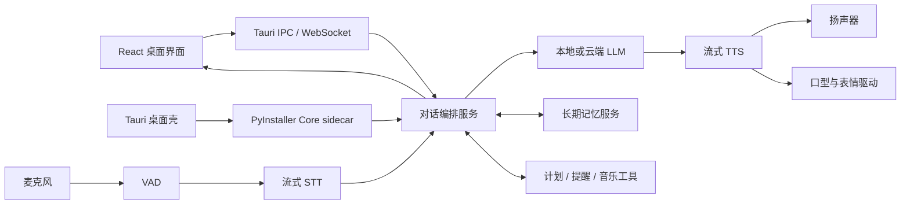

# 技术栈说明

## 选型原则

心屿优先考虑四件事：低延迟、本地隐私、可替换模型和桌面体验。模型与供应商都通过适配层接入，避免 UI、记忆和业务逻辑被某一个 API 绑定。

## 当前已落地

| 模块 | 技术 | 状态 |
| --- | --- | --- |
| Web UI | React 19.2、React DOM 19.2 | 已实现 |
| 构建工具 | Vite 6.4 | 已实现 |
| 图标 | Phosphor Icons React | 已实现 |
| 中文字体 | Noto Sans SC Variable | 已实现 |
| 自动验证 | Node Test Runner | 已实现站点 Worker 测试 |
| Core API | Python 3.11 + FastAPI + Pydantic | 已实现 |
| 本地数据 | SQLite WAL + FTS5 + SQL 迁移 | 已实现基础链路 |
| 对话 Provider | 开发回退 + OpenAI-compatible HTTP 适配器 | 已实现适配层，待安装真实模型 |
| 实时事件 | WebSocket 事件信封 | 已实现基础通道 |
| 桌面容器 | Tauri 2 + WebView2 | 工程、托盘、通知、开机启动和品牌图标已落地，待 Rust 环境编译验收 |
| Core 封装 | PyInstaller onefile sidecar | 自动构建与独立健康检查已通过 |
| 实时语音 | Hugging Face `speech-to-speech` + Core WebSocket 代理 | 已固定为 Git 子模块并接入 UI；待下载模型与真实声学验收 |

版本以 `apps/desktop-ui/package-lock.json` 和子模块提交为准，文档中的版本只用于快速理解。

## 目标运行架构



### 桌面层

- 目标：Tauri 2 + React。
- 原因：前端原型可以直接复用；安装包和常驻资源占用通常比完整 Chromium 容器更轻。
- Electron 保留为备选：如果后续严重依赖 Chromium 专属能力或 Node 原生生态，可重新评估。

### 智能体与服务层

- 目标：Python 3.10/3.11 + FastAPI + WebSocket。
- 职责：会话状态、模型路由、打断处理、工具调用、记忆读写、事件分发。
- UI 不直接持有模型密钥，也不把模型厂商返回格式扩散到页面组件。

### 实时语音

参考 `third_party/speech-to-speech` 的模块化链路：

```text
麦克风 → VAD → 流式 STT → LLM → 分句器 → 流式 TTS → 播放
```

必须支持：

- 首包音频延迟统计
- 用户插话后立即停止播报
- STT 中间结果与最终结果区分
- 回声消除和输入设备切换
- 每个模块可本地或云端替换

候选组件不在第一阶段锁死。应通过 `STTProvider`、`LLMProvider`、`TTSProvider` 接口完成基准测试后再定型。

### 记忆

- 结构化存储：SQLite。
- 关键词检索：FTS5。
- 语义检索：`sqlite-vec` 或独立向量库；早期优先单机简单性。
- 记忆类型：用户事实、偏好、人物关系、共同事件、承诺、计划与情绪摘要。
- 所有自动写入都保留来源消息、置信度和更新时间；用户可以查看、修正和删除。

### 动态人物

心屿不采用 2.5D 分层或插画式 Live2D 作为默认人物路线，默认目标是写实高质量模式：

1. **统一角色资产**：固定 `character_id`、脸型、马尾发型、服装体系、房间和摄影参数。
2. **高质量状态视频库**：用 LivePortrait 等工具离线生成待机、倾听、思考、微笑、说话过渡和晚安等写实短视频。
3. **实时局部口型**：说话时由 MuseTalk 或后续更合适的音频驱动模型只处理脸部口型区域，避免全屏逐帧生成。
4. **时间戳合成**：人物渲染进程按照 TTS 音频时间戳选择视频帧和嘴型帧，确保暂停、插话和恢复时不漂移。
5. **硬件解码兜底**：实时口型达不到目标帧率时，自动回退到高质量预制说话视频，人物不会退化成静态图片。

### 从 RTX 5090 数字人方案借鉴的工程方法

RTX 5090 的 32 GB 显存允许更多模型同时常驻，但真正值得借鉴的是流水线设计：

- 首次导入人物时完成检测、裁剪、特征和 latent 缓存；后续对话复用缓存。
- 只推理约 256×256 的脸部兴趣区域，再合成回原始高分辨率场景。
- 解码、推理、合成、播放分别使用有界队列，所有帧携带音频时间戳。
- 人物渲染独立进程运行；崩溃或显存不足不能拖垮语音和桌面端。
- 只在 `speaking` 状态加载口型模型，`idle / listening / thinking` 播放高质量状态视频。
- 使用运行时性能档位，而不是为不同显卡维护不同产品代码。

不借鉴 5090 方案的“大模型全部常驻”和“整帧持续生成”。这两点在 16 GB 显存上会直接挤压 LLM、STT 和 TTS。

### 本机高质量档位

目标硬件：RTX 4070 Ti SUPER 16 GB、i7-14700KF、32 GB RAM。

```text
STT            → CPU 或 GPU 小模型，完成转写后释放临时显存
LLM            → 4B–8B GGUF 量化，限制上下文与 KV cache
TTS            → Qwen3-TTS 0.6B 优先
Idle 动画      → WebView 硬件解码的写实状态视频
Speaking 口型  → 独立 Avatar Worker，局部脸区实时推理
降级路径       → 高质量预制说话视频，不退回 2.5D
```

第一阶段必须分别测量 720p/25fps 与 1080p/25fps 合成效果。若本地 LLM 与实时口型无法同时满足延迟，优先将 STT 移到 CPU、缩小 LLM 或在“高质量人物模式”中允许可选云端 LLM，而不是降低人物资产质量。

## 数据与隐私

- 默认把对话、记忆、计划和配置保存在本机应用数据目录。
- 云端模型是可选 Provider；发送前在设置页展示数据流向。
- 密钥进入系统凭据库，不写入仓库、日志或 SQLite 明文字段。
- 日志默认脱敏，不记录完整私人对话。

## 暂不锁定的技术

- 具体 STT、LLM、TTS 模型
- 向量数据库产品
- 实时口型模型和推理后端的最终实现
- 云同步与账号系统

这些选择必须由延迟、显存、中文效果、许可证和目标硬件基准共同决定。
