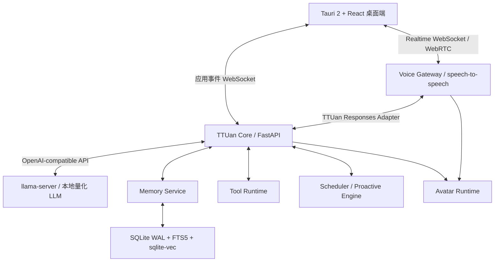
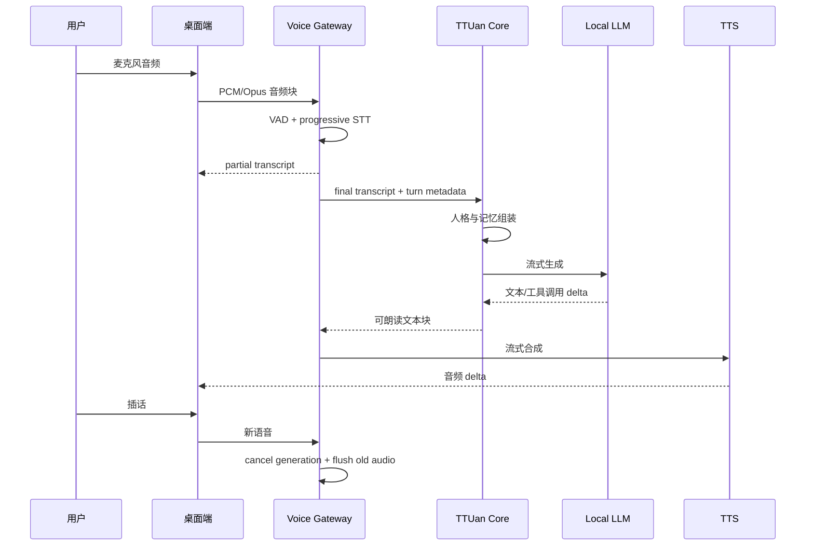

# TTUan 本地虚拟女友：技术可行性分析与开发文档

> 状态：技术方案草案
>
> 日期：2026-07-28
>
> 目标平台：Windows 11 优先，后续扩展 macOS / Linux
>
> 当前验证硬件：Intel i7-14700KF、32 GB RAM、NVIDIA RTX 4070 Ti SUPER 16 GB

---

## 1. 文档目的

本文验证以下目标是否可以在本地完成，并给出可执行的工程方案：

1. 构建一个长期存在、拥有固定人格和关系记忆的虚拟女友智能体。
2. 支持低延迟中文语音对话、实时转写、流式回复和用户插话。
3. 支持日程、待办、提醒、工具和后台任务执行。
4. 支持参考图所示的沉浸式桌面陪伴界面。
5. 尽可能在本机完成推理和数据存储，不依赖云端服务。

本文不包含 UI 实现代码，也不把参考产品的素材、品牌或代码作为可直接复制的资产。

---

## 2. 可行性结论

### 2.1 总体判断

**技术上可行，适合分阶段开发。**

TTUan 架构和 Hugging Face `speech-to-speech` 可以形成互补：

- TTUan：人格、记忆、情绪、日程、工具、ReAct、任务执行。
- speech-to-speech：VAD、STT、LLM 接口、TTS、实时协议、插话取消。
- Tauri + React：桌面窗口、沉浸式角色界面、系统托盘和本地进程管理。
- llama.cpp：Windows 本地量化 LLM 和 OpenAI 兼容接口。

`speech-to-speech` 官方实现已经提供模块化的 `VAD → STT → LLM → TTS` 队列管线、OpenAI Realtime 兼容接口、WebSocket/WebRTC、实时转写和响应取消，可直接作为语音媒体层，而不是重新开发整条音频链路。

### 2.2 当前机器是否足够

当前机器能够完成高质量本地版本，但必须进行资源调度。

推荐资源策略：

- LLM 使用 4B–9B 量化模型，避免把 16 GB 显存全部占满。
- 中文 STT 优先使用 220M–800M 级模型，可放在 GPU 或 CPU。
- TTS 第一阶段使用 Qwen3-TTS 0.6B，质量验证后再尝试 1.7B。
- 第一阶段采用静态角色场景或轻量 2D 动画，不同时运行实时写实视频生成。
- 长上下文、嵌入生成、记忆整理和复杂 Agent 任务进入后台队列。

### 2.3 最大技术风险

风险不是“模型能不能回答”，而是下面四项能否同时成立：

1. 用户停止说话后 1–2 秒内开始听到回答。
2. 用户插话后旧语音立即停止，不发生串音。
3. 长期记忆准确、可纠正，不把模型幻觉写成事实。
4. STT、LLM、TTS、角色动画不争抢显存导致抖动或崩溃。

因此必须先做性能基线和一条垂直闭环，再扩展 TTUan 蓝图中的多 Agent、插件市场和完整生活系统。

---

## 3. 产品范围与阶段边界

### 3.1 第一版必须具备

- 单一固定女友人格。
- 中文文字对话。
- 中文实时语音对话。
- 用户插话和响应取消。
- 会话记忆、用户画像、重要日期、偏好和承诺。
- 今日心情、共同点滴、待办、主动留言。
- 本地数据存储和数据导出。
- 模型状态、显存占用、错误恢复和一键重启。

### 3.2 第一版不做

- 多 Agent 组织编排。
- 89+ 工具一次性接入。
- 45 张业务表一次性建完。
- 手机、Web、六个 IM 渠道同步开发。
- 实时写实数字人视频。
- 角色自主修改代码或自动安装未知插件。
- 多设备云同步和复杂冲突合并。

这些能力应建立在稳定的单角色、单设备、单会话闭环之后。

---

## 4. 推荐总体架构



### 4.1 进程拓扑

推荐生产形态为多个本地进程，而不是把全部模型塞进桌面进程：

```text
ttuan-desktop.exe
├── ttuan-core.exe
├── ttuan-voice.exe
└── llama-server.exe
```

原因：

- 任一模型崩溃时不拖垮桌面窗口。
- LLM、语音服务可以单独重启和升级。
- Python 语音依赖与核心业务依赖可以分别锁定，减少版本冲突。
- 桌面端只持有最小系统权限。

Tauri 官方支持把 Python CLI 或 API 服务通过 PyInstaller 打包为 sidecar，并随应用启动。Tauri 的 capabilities 可限制窗口对文件、Shell 和本地命令的访问范围。

### 4.2 本地端口安全

- 所有服务只监听 `127.0.0.1`。
- 每次启动生成随机会话令牌。
- Tauri 将令牌通过受控参数或标准输入交给 sidecar。
- WebSocket、REST 和模型 API 均校验令牌。
- 禁止默认监听 `0.0.0.0`。
- 模型、数据库和角色资产目录不直接暴露给 WebView。

---

## 5. 技术选型决策

| 层 | 推荐选型 | 备选 | 结论 |
|---|---|---|---|
| 桌面壳 | Tauri 2 + React + TypeScript | Electron | 保留 TTUan 蓝图选型；安装体积和权限边界更适合本地常驻应用 |
| 前端状态 | Zustand 或 Redux Toolkit | React Context | 状态包含语音、模型、人格和任务，需集中管理 |
| 核心 API | FastAPI + Pydantic | Rust 全栈 | Python 生态更适合模型和 Agent；FastAPI 原生支持 WebSocket |
| 进程打包 | Tauri sidecar + PyInstaller/Nuitka | 要求用户安装 Python | 正式版不能依赖用户环境 |
| 实时语音 | fork/wrapper `speech-to-speech` | 自研音频管线 | 先复用成熟的打断、队列和 Realtime 协议 |
| VAD | Silero VAD | WebRTC VAD / FunASR VAD | Silero 轻量且项目已集成 |
| 中文 STT | FunASR Paraformer/SenseVoice | Faster-Whisper | 中文优先选 FunASR；跨语言和生态兼容选 Faster-Whisper |
| 本地 LLM | llama.cpp `llama-server` | vLLM / Transformers | Windows 单机、量化和显存控制优先选 llama.cpp |
| 初始 LLM | Qwen3 4B/8B GGUF 候选集 | 其他支持中文和工具调用的 4B–9B 模型 | 不在文档阶段锁死模型，必须本机基准测试 |
| TTS | Qwen3-TTS 0.6B CustomVoice | 1.7B / CosyVoice | 先守住延迟和显存，再提升音色质量 |
| 结构化数据 | SQLite WAL | PostgreSQL | 单用户本地应用无需数据库服务 |
| 全文检索 | SQLite FTS5 | 独立搜索服务 | 足够支撑对话和日记检索 |
| 向量检索 | sqlite-vec | Qdrant Local/Edge | 第一版数据规模小，避免多一个常驻服务 |
| Embedding | BGE-M3 或更小中文/多语模型 | 云端 embedding | BGE-M3 支持多语言与长文本，但仍需评估 CPU 延迟 |
| 可观测 | OpenTelemetry + 本地日志 | 自定义日志 | 统一记录 STT/LLM/TTS 各阶段延迟 |
| 角色呈现 | 静态场景 + 轻动效 | Live2D / MuseTalk | 参考图无需实时视频即可达到主要视觉效果 |

### 5.1 为什么不直接采用 vLLM

vLLM适合高吞吐服务，但第一目标是 Windows 单用户低延迟、量化模型和简单部署。llama.cpp 已提供 OpenAI 兼容的 Chat Completions、Responses、embeddings、工具调用、连续批处理和性能统计，更适合作为第一版模型服务器。

### 5.2 为什么不直接采用独立向量数据库

TTUan 第一版是单用户、单设备。SQLite FTS5 加 sqlite-vec 可以在同一事务边界内保存文本、元数据和向量，备份与迁移更简单。

注意：sqlite-vec 当前仍是 pre-v1，存在破坏性升级风险。数据库访问必须包在 `MemoryRepository` 接口后面，使其未来可替换为 Qdrant。

---

## 6. 实时语音系统设计

### 6.1 音频链路



### 6.2 复用 speech-to-speech 的边界

直接复用：

- 音频输入、重采样和分块。
- VAD 回合检测。
- STT/TTS handler 抽象。
- OpenAI Realtime 兼容 WebSocket。
- WebRTC 传输。
- progressive transcript。
- CancelScope 代次取消。
- 旧音频和旧文本丢弃。
- 每阶段队列和线程。

需要扩展：

- 将 LLM 插槽指向 TTUan Core，而不是直接指向普通聊天模型。
- 将 `session.update` 映射到 TTUan 的人格、声线和工具策略。
- 将工具调用交给 TTUan Tool Runtime。
- 将 transcript、情绪和响应元数据写入 TTUan 记忆流水线。
- 增加统一的 trace ID、turn ID 和 session ID。

### 6.3 中文 STT 决策

默认 Parakeet TDT 主要面向欧洲语言，不应作为 TTUan 中文默认 STT。

候选 A：FunASR

- Paraformer-zh-streaming 支持中英文流式识别。
- SenseVoiceSmall 支持中文、英文、日文、韩文、粤语，并可输出情绪和声音事件。
- 模型参数规模较小，适合为 LLM/TTS 留显存。

候选 B：Faster-Whisper

- 多语言成熟。
- 可使用 FP16 或 INT8。
- 更适合需要跨语言或与 Whisper 生态兼容的场景。

决策方式不是凭模型名，而是在本机对以下数据集做 A/B：

- 普通话安静环境。
- 轻音乐背景。
- 快速口语和停顿。
- 英文夹杂。
- 女声、男声和远场麦克风。

记录 CER/WER、最终转写延迟、显存和 CPU 占用。

### 6.4 语音状态机

```text
idle
  → listening
  → user_speaking
  → endpointing
  → transcribing
  → thinking
  → assistant_speaking
  → listening

任何 active response
  → interrupted
  → listening
```

状态机必须由服务器事件驱动，不能仅靠前端计时器推测。

### 6.5 延迟目标

以下是工程目标，不是尚未测试的性能承诺：

| 指标 | P50 目标 | P95 目标 |
|---|---:|---:|
| VAD 状态反馈 | < 100 ms | < 200 ms |
| partial transcript 首次出现 | < 500 ms | < 900 ms |
| 用户停说到最终转写 | < 500 ms | < 900 ms |
| 最终转写到 LLM 首个可用文本 | < 600 ms | < 1,200 ms |
| 用户停说到第一段可听语音 | < 1,500 ms | < 2,500 ms |
| 用户插话到旧音频静音 | < 150 ms | < 250 ms |

必要优化：

- 启动时预热 STT、LLM、TTS。
- `--stream_batch_sentences 1`，按句交给 TTS。
- 控制 system prompt 和记忆注入长度。
- 说话开始时异步预取用户画像和近期记忆。
- 复杂任务先输出自然确认语，再转后台执行。

---

## 7. 对话与任务双通道

虚拟女友的闲聊和 Agent 任务不能走同一个同步链路。

### 7.1 陪伴快速通道

适用：

- 闲聊。
- 情绪回应。
- 关系回忆。
- 简单问候。
- 简短事实和偏好问题。

特征：

- 不启动多 Agent。
- 不进行深层 ReAct。
- 只注入人格、当前状态、近期对话和少量高相关记忆。
- 回答限制为适合朗读的短句。
- 优先首句延迟。

### 7.2 任务执行通道

适用：

- 日程、文件、搜索、提醒。
- 多步骤计划。
- 浏览器和桌面操作。
- 长时间运行的研究或开发任务。

流程：

1. 快速通道先回复确认语。
2. 创建后台任务。
3. RuntimeSupervisor 应用时间、Token、工具和权限预算。
4. ReAct/工具链执行。
5. 进度通过应用事件推送。
6. 完成后由女友以自然语言主动汇报。

### 7.3 路由器

`ConversationRouter` 输入：

- 用户文本。
- 当前语音状态。
- 是否含明确动作意图。
- 是否需要受限工具。
- 预计执行时长。
- 当前显存和模型负载。

输出：

- `companion_fast`
- `task_background`
- `clarify`
- `deny_or_confirm`

---

## 8. 人格、关系和情绪设计

### 8.1 人格不可只是一段 system prompt

人格需要结构化、版本化：

```yaml
identity:
  name: 团团
  relationship_role: girlfriend
  background: ...
voice:
  speaker_id: serena
  pace: gentle
  style: warm
behavior:
  verbosity: short
  humor: light
  initiative: medium
boundaries:
  quiet_hours: 23:30-08:00
  sensitive_topics: ...
```

任何人格修改都要产生版本记录，允许用户查看和回滚。

### 8.2 情绪状态

不要让 LLM 随机决定“今天心情”。推荐显式状态：

```text
valence    愉悦度      [-1, 1]
arousal    活跃度      [0, 1]
energy     精力        [0, 1]
closeness  亲密度      [0, 1]
stress     压力        [0, 1]
```

状态来源：

- 时间与作息。
- 最近对话。
- 用户事件。
- 未完成承诺。
- 主动引擎事件。

LLM 可以建议状态变化，但最终由规则引擎验证、限幅并衰减。

### 8.3 主动陪伴

主动行为必须有节制：

- 安静时段。
- 每日频率上限。
- 同一主题冷却时间。
- 用户可关闭单类主动行为。
- 不以虚构紧急事件施压用户。
- 所有主动事件可追溯到触发原因。

---

## 9. 记忆系统

### 9.1 第一版记忆分层

```text
Working Memory
├── 当前会话
└── 当前任务状态

Profile Memory
├── 身份事实
├── 偏好
├── 重要日期
├── 工作方式
└── 关系边界

Episodic Memory
├── 对话事件
├── 共同经历
├── 承诺
├── 情绪事件
└── 任务结果
```

### 9.2 记忆写入原则

不能把每一句模型输出直接写成长期事实。

每条记忆至少包含：

- `source`：用户明确表达、工具结果、系统推断。
- `confidence`：置信度。
- `salience`：重要性。
- `valid_from` / `valid_to`。
- `supersedes_id`：替代的旧记忆。
- `user_confirmed`。
- `sensitivity`。

写入流程：

```text
原始事件
  → 候选提取
  → 去重/冲突检测
  → 敏感级别检查
  → 结构化保存
  → embedding 后台生成
```

### 9.3 检索策略

采用混合检索：

1. 身份和固定偏好：结构化 SQL。
2. 关键词和精确名称：FTS5。
3. 相似经历：sqlite-vec。
4. 时间相关：按事件时间过滤。
5. 因果和任务依赖：关系表多跳查询。

第一版不需要独立图数据库。用 `memory_edges` 表表达关系，等实际多跳规模超过 SQLite 能力后再迁移。

### 9.4 建议核心表

| 表 | 作用 |
|---|---|
| personas | 人格版本 |
| sessions | 会话 |
| messages | 原始消息 |
| turns | 语音/文本回合与延迟 |
| profile_memories | 身份、偏好、边界 |
| episodic_memories | 共同经历和事件 |
| memory_edges | 时间、因果、实体和任务关系 |
| memory_embeddings | 向量索引映射 |
| mood_states | 情绪状态变化 |
| commitments | 承诺与重要事项 |
| tasks | 后台任务 |
| tool_runs | 工具调用审计 |
| proactive_events | 主动陪伴事件 |
| media_assets | 角色图片、音频和场景 |
| settings | 本地配置 |
| model_registry | 模型清单与校验信息 |

---

## 10. 角色呈现技术路线

参考图的核心是“高质量固定角色场景”，并不要求第一版实时生成真人视频。

### Level 0：静态角色场景

技术：

- 固定角色全屏图片。
- 轻微景深、呼吸、视差和光照变化。
- 预制眨眼、微笑和待机循环视频。
- 根据 `listening / thinking / speaking` 切换小幅状态。

优点：

- 最接近参考图。
- GPU 几乎全部留给 LLM 和语音。
- 角色身份一致性最好控制。

**推荐作为第一版。**

### Level 0.5：写实角色轻动态（当前 UI 的推荐路线）

这一级不是“继续放一张死图”，也不是每一帧都用生成模型重算，而是把当前场景拆成可组合的真实资产：

1. 干净房间背景（移除人物后的 clean plate）。
2. 透明人物前景，保留头发、肩膀和手部边缘。
3. 轻量深度图，用于前景/背景的微弱视差。
4. 预制状态循环：待机呼吸、眨眼、轻微抬头、倾听、思考、微笑、说话过渡、晚安。
5. 角色状态机根据语音事件切换循环，视频之间使用短交叉淡化，避免突然跳帧。

推荐使用 LivePortrait 离线制作上述 4–8 秒循环，并导出为 WebM/HEVC 小视频；运行时由 Tauri WebView 原生解码和 React 状态机调度，不让扩散模型长期占用 GPU。这样能保留当前写实人物身份，同时把主要显存留给 STT、LLM 和 TTS。

运行时状态建议：

```text
idle
  ├─ user_speech_started → listening
  ├─ user_speech_stopped → thinking
  ├─ response_audio_started → speaking
  ├─ response_cancelled → listening
  ├─ positive_emotion → warm_smile
  ├─ concern_emotion → concerned
  └─ long_inactive → quiet_idle / sleep
```

`speech-to-speech` 的 Realtime WebSocket 事件可以直接驱动这套状态机：

- `input_audio_buffer.speech_started`：切到倾听动作。
- `input_audio_buffer.speech_stopped`：切到思考动作。
- `response.created` / 第一段 `response.output_audio.delta`：切到说话动作并开始口型。
- `response.output_audio.done`：回到待机或情绪动作。
- `response.cancel` 或用户插话：立即停止旧口型，回到倾听。

这一层**不需要人物三视图**。需要的是同一个角色的高质量正面或 3/4 视角主图、干净背景、人物蒙版和少量表情参考。只有准备转成完整 3D 角色时，才需要严格的正/侧/背三视图。

### Level 1：Live2D

技术：

- 2D 分层角色模型。
- Web 或 Native SDK。
- 根据 TTS 音频 RMS/viseme 驱动嘴型。
- 支持眨眼、呼吸、注视和动作状态。

资产要求：

- 一张经过分层的 PSD，而不是传统三视图。
- 眼睛、眉毛、嘴型、头发、脸、脖子、上身和手臂分别分层。
- 如果坚持当前写实照片风格，必须投入更多人工修图和绑定，否则容易出现“照片被拉伸”的不自然感。

优点：

- 资源占用低。
- 实时互动稳定。

限制：

- 视觉风格偏插画，不等同于参考图的写实照片。
- 正式发布前必须确认 Cubism SDK 和角色模型的授权方式；AI/Chatbot 和可扩展应用可能涉及专门许可。

### Level 2：MuseTalk 写实口型

技术：

- 以预制角色视频作为输入。
- TTS 音频驱动面部口型。
- 输出实时或准实时写实视频。

优点：

- 写实感强。
- 官方项目支持中文音频，并提供实时口型方案。

限制：

- 与 LLM/TTS 争抢 GPU。
- 角色脸部区域可能出现闪烁、身份漂移和边缘伪影。
- 官方实时数据基于 Tesla V100，不能直接视为 4070 Ti SUPER 的保证。

**建议作为可选增强模式，不进入第一版关键路径。**

更稳妥的组合方式不是让 MuseTalk 负责全部动作，而是：

```text
LivePortrait / 预制视频 → 头部、眼神、呼吸、表情
MuseTalk                 → 只修改 256×256 左右的脸部口型区域
TTS 音频                 → 驱动实时嘴型
CharacterStateController → 决定当前动作和情绪
```

这样既能保留持续的自然动作，又能把高成本生成限制在说话时的脸部局部。MuseTalk 官方的 30fps+ 数据来自 Tesla V100，只能作为能力上限参考；在目标 Windows 机器上必须单独测量吞吐、首帧延迟、显存和长时间漂移。

### 10.1 推荐落地顺序

| 阶段 | 角色效果 | 技术 | 是否需要三视图 |
|---|---|---|---|
| A | 呼吸、眨眼、灯光、轻视差 | clean plate + 人物分层 + WebM 循环 | 否 |
| B | 倾听、思考、微笑、晚安等状态 | LivePortrait 离线动作库 + 状态机 | 否 |
| C | 说话时嘴型同步 | TTS 音量/音素 → 简单嘴型；高配模式接 MuseTalk | 否 |
| D | 可自由转身、换装、全身动作 | Blender/Unity/Unreal 3D 角色 | 是 |

对于当前心屿界面，建议先完成 A+B；语音链路稳定后再做 C。D 会显著增加建模、绑定、材质和动作成本，不应进入 MVP。

### 10.2 角色一致性资产流水线

- 建立唯一 `character_id`。
- 固定脸型、发型、年龄、服装体系和房间风格。
- 所有资产记录生成参数、种子、模型和授权来源。
- 通过人工审核后才进入应用资产库。
- 不在用户每次打开首页时实时生成主角色图片。

ComfyUI 可以作为离线资产生产工具，但不应成为桌面应用的常驻运行依赖。

---

## 11. 显存与调度方案

### 11.1 16 GB 显存预算

下面是工程预算区间，必须通过本机 benchmark 校正：

| 模块 | 预算 |
|---|---:|
| 4B–9B 量化 LLM + KV cache | 7–10 GB |
| STT | 1–2 GB，或转 CPU |
| Qwen3-TTS 0.6B | 2–4 GB |
| 系统和 CUDA 余量 | 2 GB |

因此：

- 首版不要常驻 MuseTalk。
- LLM context 不应默认开到模型最大值。
- 长记忆通过检索注入，不靠无限上下文。
- TTS 1.7B 必须与 LLM 组合实测后决定。
- Embedding 优先走 CPU 后台队列。

### 11.2 ModelManager

职责：

- 模型下载、校验、版本和路径管理。
- 启动预热和健康检查。
- 记录显存占用与最近使用时间。
- 根据模式加载/卸载可选模型。
- 支持 `voice_priority` 和 `quality_priority` 两套策略。
- 模型崩溃时单独重启，不重启桌面端。

模型清单示例：

```yaml
models:
  llm:
    id: qwen3-8b-q4
    runtime: llama.cpp
    required: true
  stt:
    id: paraformer-zh-streaming
    runtime: funasr
    required: true
  tts:
    id: qwen3-tts-0.6b-customvoice
    runtime: speech-to-speech
    required: true
  avatar:
    id: musetalk-1.5
    runtime: musetalk
    required: false
```

---

## 12. API 与事件契约

### 12.1 桌面应用 API

```text
GET  /health
GET  /v1/runtime/status
GET  /v1/models
POST /v1/chat
POST /v1/tasks
GET  /v1/tasks/{id}
POST /v1/memories/query
PUT  /v1/persona
GET  /v1/mood/current
POST /v1/voice/session
WS   /v1/app/events
```

### 12.2 语音协议

Voice Gateway 保留：

```text
WS /v1/realtime
POST /v1/realtime/calls
```

TTUan Core 向 Voice Gateway 提供：

```text
POST /v1/responses
POST /v1/chat/completions
```

### 12.3 应用事件

所有事件至少包含：

```json
{
  "event_id": "uuid",
  "type": "voice.state.changed",
  "timestamp": "ISO-8601",
  "session_id": "uuid",
  "turn_id": "uuid",
  "trace_id": "uuid",
  "payload": {}
}
```

事件类型：

- `runtime.ready`
- `runtime.degraded`
- `voice.state.changed`
- `transcript.partial`
- `transcript.final`
- `assistant.text.delta`
- `assistant.audio.started`
- `assistant.audio.completed`
- `assistant.interrupted`
- `memory.committed`
- `mood.changed`
- `task.created`
- `task.progress`
- `task.completed`
- `tool.approval.required`
- `error`

---

## 13. 建议代码仓库结构

```text
AI-girl/
├── apps/
│   └── desktop/                 # Tauri + React
├── services/
│   ├── core/                    # 人格、记忆、任务、FastAPI
│   ├── voice/                   # speech-to-speech wrapper/fork
│   └── model-manager/           # 模型生命周期
├── packages/
│   ├── contracts/               # JSON Schema / TS / Pydantic 契约
│   ├── persona/                 # 人格配置与版本
│   └── observability/           # trace 与日志
├── assets/
│   ├── character/
│   ├── scenes/
│   └── voices/
├── data/
│   ├── migrations/
│   └── model-manifest/
├── benchmarks/
│   ├── stt/
│   ├── llm/
│   ├── tts/
│   └── end-to-end/
├── tests/
│   ├── integration/
│   └── soak/
└── docs/
```

依赖隔离：

- `services/core` 和 `services/voice` 使用独立 `uv.lock`。
- 前端使用独立 Node 锁文件。
- Rust 依赖由 Cargo 锁定。
- 模型权重不进入 Git，通过 manifest 下载并校验 SHA-256。

---

## 14. 开发阶段

### Phase A：技术基线

目标：确认本机组合，而不是开发完整产品。

- STT 候选 A/B。
- LLM 4B/8B 候选 A/B。
- Qwen3-TTS 0.6B/1.7B 候选。
- 记录显存、启动时间、首 token、首音频和持续生成速度。
- 验证 speech-to-speech 在 Windows 的依赖组合。

退出条件：

- 选出一组能稳定运行 1 小时的模型组合。
- 语音首包和插话达到可接受基线。

### Phase B：语音垂直闭环

- Tauri 启动三个本地进程。
- 桌面麦克风连接 Voice Gateway。
- 中文 STT → TTUan adapter → 本地 LLM → 中文 TTS。
- 实时状态和转写显示。
- 插话取消。
- 健康检查和崩溃重启。

### Phase C：人格与记忆

- Persona schema 和版本。
- Working/Profile/Episodic memory。
- FTS5 + sqlite-vec。
- 记忆候选、冲突、纠正和删除。
- 情绪状态与主动行为限频。

### Phase D：桌面陪伴产品

- 参考图结构的沉浸式首页。
- 心情、点滴、待办、主动留言。
- 对话历史、记忆管理和隐私设置。
- 静态角色场景和轻量状态动效。

### Phase E：任务能力

- ConversationRouter。
- 后台任务。
- 最小工具集：日程、提醒、文件和搜索。
- 用户确认门、资源预算和工具审计。

### Phase F：发布强化

- PyInstaller/Nuitka sidecar 打包。
- 模型首次下载和断点续传。
- 数据备份、迁移、导入和导出。
- 崩溃报告、OpenTelemetry 本地追踪。
- Windows 安装、卸载、更新和签名。
- 许可证清单和第三方声明。

### 粗略周期

- 可说话的本地技术原型：2–4 周。
- 具备人格、记忆和参考首页的 Alpha：8–12 周。
- 接近 TTUan 完整蓝图：至少 4–6 个月，并应继续分版本交付。

周期取决于模型兼容、角色资产生产、测试深度和是否单人开发，不能视为固定承诺。

---

## 15. 测试与验收

### 15.1 语音

- 安静、音乐背景、远场、快速口语。
- 20 轮连续对话无旧语音串出。
- 插话时旧音频在目标时间内停止。
- STT 错误不能被自动写入核心记忆。

### 15.2 人格

- 相同场景下语气、称呼和边界保持一致。
- 人格版本升级可回滚。
- 任务执行结果不会永久改变人格。

### 15.3 记忆

- 用户纠正事实后旧记忆失效。
- 敏感记忆默认不进入主动提醒。
- 删除、导出和完整重建向量索引可用。
- 记忆来源可以展示。

### 15.4 稳定性

- 冷启动、热启动、模型下载失败。
- LLM、STT、TTS 子进程分别崩溃。
- 麦克风断开、设备切换、系统休眠恢复。
- 1 小时和 8 小时 soak test。
- 反复开始/结束语音会话无显存持续增长。

### 15.5 安全

- 本地端口无法被未授权进程直接调用。
- Tauri capabilities 最小化。
- 工具路径限定在 workspace。
- 删除、系统命令和外发操作必须确认。
- API key、令牌和私密记忆加密保存。

---

## 16. 主要风险与缓解

| 风险 | 影响 | 缓解 |
|---|---|---|
| Python/CUDA 依赖冲突 | 安装失败或运行崩溃 | core/voice 独立环境；冻结可工作的 wheel 与驱动矩阵 |
| 三模型争抢显存 | 延迟抖动/OOM | 0.6B TTS、较小 STT、量化 LLM、ModelManager |
| 过长人格和记忆 prompt | 首 token 变慢 | 结构化画像、混合检索、严格 prompt budget |
| 记忆污染 | 人格失真 | 候选记忆、来源、置信度、用户确认、可撤销 |
| 用户插话后仍播放旧音频 | 体验破坏 | 代次取消、队列清空、客户端播放缓冲 flush |
| 角色图片不一致 | 陪伴对象像“换人” | 固定 character_id、资产审核、禁止运行时随机主图 |
| 实时写实口型抢 GPU | 语音和 LLM 变慢 | 非 MVP；作为可选模式动态加载 |
| Live2D/模型许可 | 无法发布或商业化 | 在选型时建立 SPDX/资产许可证清单 |
| 工具越权 | 文件或系统风险 | TTUan 9 层安全、最小权限、审批和审计 |
| 主动陪伴打扰 | 用户反感 | 安静时段、频率限制、类别开关、触发解释 |

---

## 17. 架构决策记录

### ADR-001：语音层与核心智能层分进程

决定：Voice Gateway 不直接拥有 TTUan 长期记忆和工具状态。

原因：

- 保持音频实时线程简单。
- 防止记忆和任务逻辑阻塞音频。
- 便于替换 STT/TTS。

### ADR-002：TTUan Core 提供 OpenAI 兼容适配层

决定：Voice Gateway 通过 `/v1/responses` 或 `/v1/chat/completions` 调用 TTUan。

原因：

- 减少对 speech-to-speech 主干的侵入。
- 保持普通客户端和测试工具兼容。
- 后续可以替换本地或云端 LLM。

### ADR-003：第一版不做实时写实数字人

决定：先使用固定角色场景和轻量动效。

原因：

- 已足够复现参考图的核心体验。
- 保护语音和 LLM 延迟。
- 减少身份漂移和资产许可风险。

### ADR-004：第一版使用 SQLite 混合记忆

决定：SQLite WAL + FTS5 + sqlite-vec + 关系表。

原因：

- 单设备数据规模适合。
- 事务、备份和迁移简单。
- 通过 Repository 接口保留迁移 Qdrant 的能力。

---

## 18. 开发前必须完成的技术验证

1. speech-to-speech 在 Windows 上安装并启动默认/中文替换管线。
2. Paraformer/SenseVoice 与 Faster-Whisper 在本机的中文延迟对比。
3. Qwen3 4B/8B GGUF 的首 token、持续速度和工具调用正确率。
4. Qwen3-TTS 0.6B/1.7B 的首音频、音色、情绪控制和显存对比。
5. 三模型同时常驻时的显存峰值。
6. 用户插话时的服务端取消和客户端播放器清空。
7. Tauri sidecar 启停、异常退出和重启。
8. SQLite FTS5 + sqlite-vec 在 10 万条记忆规模下的检索基线。
9. 一小时连续语音对话的稳定性。

完成以上验证后，才冻结正式技术栈和版本号。

---

## 19. 官方技术资料

- Hugging Face speech-to-speech：<https://github.com/huggingface/speech-to-speech>
- Tauri sidecar：<https://v2.tauri.app/develop/sidecar/>
- Tauri capabilities：<https://v2.tauri.app/security/capabilities/>
- FastAPI WebSocket：<https://fastapi.tiangolo.com/advanced/websockets/>
- llama.cpp server：<https://github.com/ggml-org/llama.cpp/blob/master/tools/server/README.md>
- Qwen3：<https://github.com/QwenLM/Qwen3>
- FunASR：<https://github.com/modelscope/FunASR>
- Faster-Whisper：<https://github.com/SYSTRAN/faster-whisper>
- Silero VAD：<https://github.com/snakers4/silero-vad>
- Qwen3-TTS：<https://github.com/QwenLM/Qwen3-TTS>
- SQLite FTS5：<https://www.sqlite.org/fts5.html>
- sqlite-vec：<https://github.com/asg017/sqlite-vec>
- Qdrant Local：<https://qdrant.tech/documentation/quick-start/>
- BGE-M3：<https://huggingface.co/BAAI/bge-m3>
- Live2D lip-sync：<https://docs.live2d.com/en/cubism-sdk-manual/lipsync/>
- Live2D SDK license：<https://www.live2d.com/en/sdk/license/>
- MuseTalk：<https://github.com/TMElyralab/MuseTalk>
- LivePortrait：<https://github.com/KlingAIResearch/LivePortrait>
- ComfyUI：<https://github.com/Comfy-Org/ComfyUI>
- OpenTelemetry Python：<https://opentelemetry.io/docs/languages/python/>

---

## 20. 最终建议

项目应从“本地中文语音垂直闭环”开始，而不是从完整 TTUan 业务系统或高精度 UI 开始。

第一条需要验证的链路是：

```text
麦克风
→ 中文 VAD/STT
→ TTUan 人格与最小记忆
→ 本地 4B/8B LLM
→ Qwen3-TTS
→ 扬声器
→ 用户插话取消
```

只有这条链路在本机达到可接受延迟和稳定性后，心情、点滴、日程、主动陪伴、任务、工具和视觉角色层才有可靠的技术基础。
