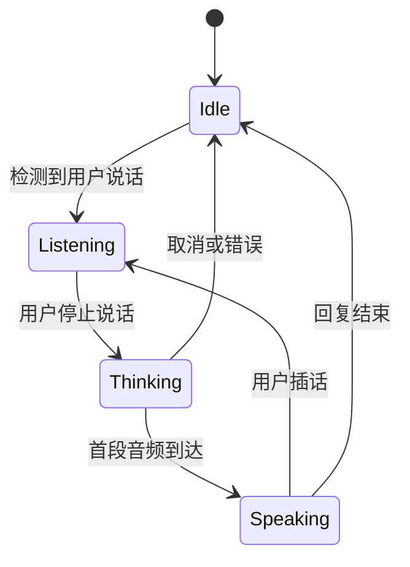

# 页面与交互规划

## 核心原则

人物始终是主视觉。功能像桌面上的轻工具一样围绕人物出现，不把主场景变成传统后台仪表盘。右侧适合承载摘要与行动，底部只保留音乐、主输入和此时心情。

## 此刻

用途：打开应用后立即获得陪伴感。

- 中央偏左：人物主场景。
- 顶部：胶囊导航。
- 右侧：今天的点滴、明日清单和一句主动陪伴。
- 底部：音乐、语音/文字输入、此时心情。
- 待机状态可出现极轻的呼吸、眨眼、视线和灯光变化。

## 对话

用途：进行连续语音或文字交流，同时保留人物存在感。

- 对话记录不应全屏覆盖人物，可使用半透明侧栏或抽屉。
- 明确展示“倾听 / 思考 / 说话 / 被打断”状态。
- 支持文字输入、按住说话、连续对话和立即停止播报。
- 会话可以命名、搜索和删除。
- 当模型引用长期记忆时，允许用户查看来源。

## 回忆

回忆不是普通聊天记录，而是经过整理且可由用户管理的长期记忆。

内容分为：

- 关于你的事：身份、偏好、习惯和重要的人。
- 我们的点滴：共同经历和有时间线的事件。
- 约定与牵挂：未来要做的事、承诺和需要关心的事项。
- 情绪线索：只保存对长期陪伴有价值的总结，避免给用户贴永久标签。

交互：

- 时间线、主题和重要度筛选。
- 每条记忆展示来源、更新时间和置信度。
- 用户可修正、合并、置顶、遗忘。
- “为什么记住”使用自然语言说明，不暴露内部向量分数。

## 计划

用途：管理用户自己的计划，也承载“我们一起做”的轻量约定。

- 今日、明日、本周、以后四个视图。
- 普通待办与共同约定在视觉上区分。
- 计划可以来源于手动创建或对话建议，但自动建议不能未经确认直接成为强提醒。
- 完成计划后可以生成一条点滴，但需要用户同意。
- 后续接入系统日历时必须提供独立授权和同步状态。

## 更多

- 角色：称呼、性格边界、声音、主动程度。
- 模型：本地/云端 Provider 和资源档位。
- 隐私：记忆开关、数据位置、导出、删除。
- 设备：麦克风、扬声器、摄像头（如未来启用）。
- 外观：主题、动效强度、低性能模式。
- 关于：版本、许可证和第三方组件。

## 人物动态状态机

每个状态只需要少量稳定动作：

- `Idle`：呼吸、偶尔眨眼、轻微视线移动。
- `Listening`：目光聚焦、轻点头，避免频繁动作。
- `Thinking`：短暂移开视线或轻微停顿。
- `Speaking`：口型、细微眉眼和句尾动作。
- `Interrupted`：立即闭口，恢复倾听姿态。

## 第一阶段人物实现

不需要先制作完整三视图。当前正面坐姿适合先做 2.5D 分层：

1. 分离背景、人物、前后发层、眼睛、嘴部、手臂和桌面前景。
2. 用遮罩和局部形变制作呼吸、眨眼和轻微转头。
3. 由状态机控制动作，不播放无意义的循环大动作。
4. 口型先使用音量与音素的简化映射；验证体验后再投入 Live2D 或生成式肖像。
